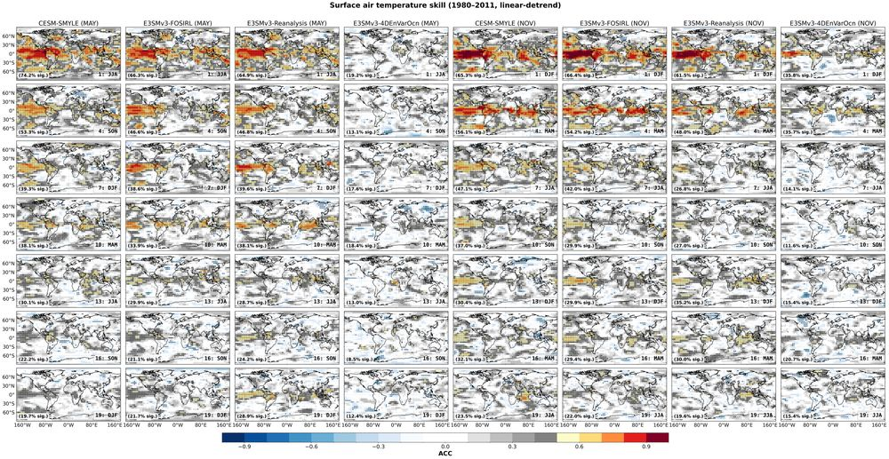
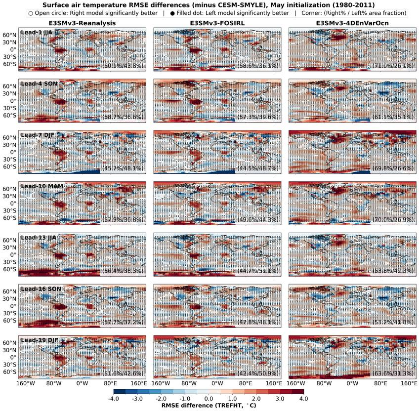
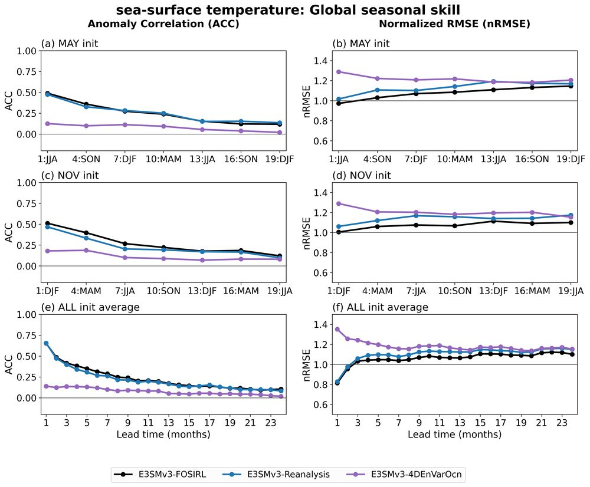
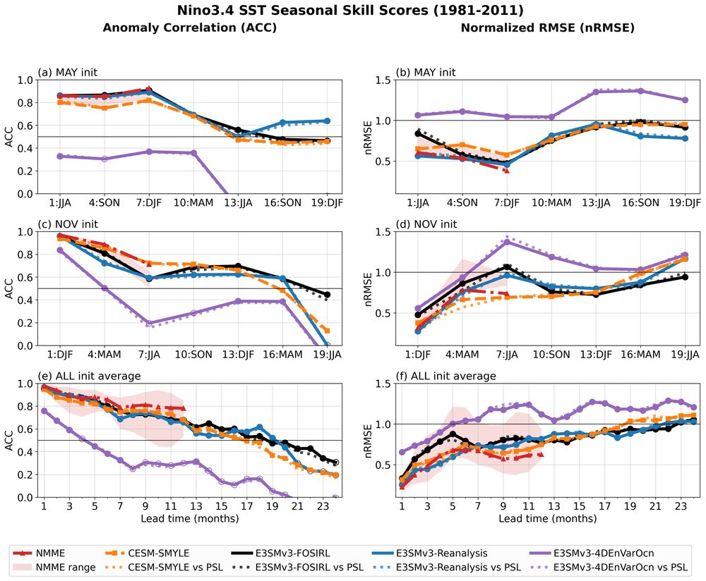
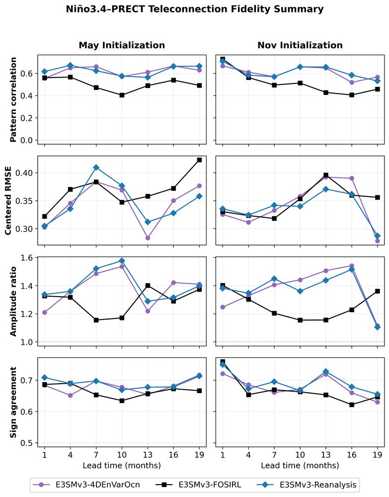
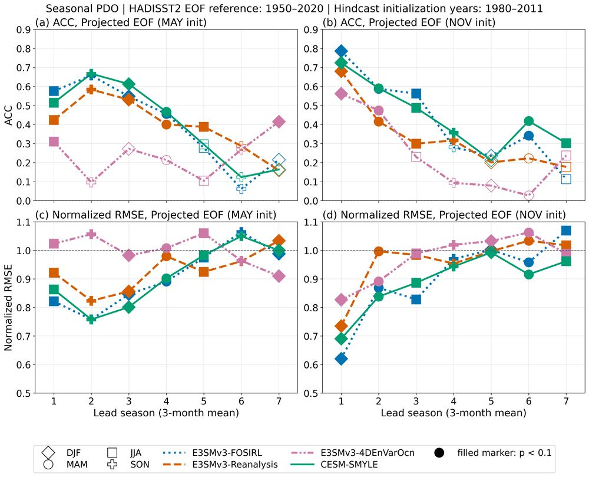

# Diagnostics Gallery

Every figure the notebook suite produces is collected into one browsable web page:

**[E3SM-S2D Diagnostics Portal](https://portal.nersc.gov/cfs/e3sm/zhan391/e3sm-s2d_diag/)**

The page is regenerated by `8_run_viewer_webpage.ipynb` from the figures in the output
folder (`ESP_LAB_FIGURE_ROOT`). It compares three E3SMv3 hindcast sets
(E3SMv3-FOSIRL, E3SMv3-Reanalysis, E3SMv3-4DEnVarOcn) with CESM-SMYLE, NMME, and
observations for May and November initializations, 1980–2011.

## How the page is organized

The default **Quick Buttons** view has one section per diagnostic group. Each row is a
field, index, or mode, and each button opens one figure in a full-size pop-out with its
caption. A greyed button marks a figure that does not exist for that row, for example no
CESM-SMYLE comparison for sea-surface salinity. The Teleconnections section can be
filtered by driving index or mode.

| Section | Figures | Rows | Buttons | Produced by |
|---|---:|---|---|---|
| Lead-time ACC | 35 | TREFHT, TS, PRECT, PSL, SST, SSS, OHC700, H2OSNO, H2OSOI, TWS | ACC Skill Map, Model Compare, Difference, Sample Period Sensitivity, Case Difference | `1a_atm`, `1a_ocn`, `1a_lnd` |
| Lead-time RMSE | 64 | the same 10 fields | RMSE Skill Map (Global/CONUS), nRMSE Difference, Case Difference, Total RMSE (Global/CONUS), RMSE Difference (May/Nov) | `1b_*`, `1c_*` |
| Regional ACC / nRMSE | 84 | atmosphere, ocean, and land fields | Global, Land, Ocean, Tropics, NH/SH Extratropics, CONUS, North America, Eurasia | `2a` |
| SST Index | 26 | 13 indices (Niño1+2, Niño3, Niño3.4, Niño4, ONI, RONI, TNI, IOD, TNA, TSA, AtlNino, AtlMDR, Pacific warm pool) | ACC Skill, Time Series | `3a` |
| Modes of Variability | 72 | 12 modes (NAM, NAO, SAM, PNA, NPO, EA, SCA, PSA1, PSA2, PDO, NPGO, AMO) | Skill vs Lead, PC Time Series, EOF Year 1/2, Teleconnection May/Nov | `4a` |
| ELI | 6 | ELI diagnostics | ACC / nRMSE Skill, Time Series, Leadtime Climatology, NMME Benchmark, Niño3.4 vs ELI | `5a`, `5b` |
| Initial Shock | 28 | TREFHT, TS, PRECT, PSL | Lead Y1/Y2 and Monthly Heatmaps, Seasonal Abs Change, Seasonal Scatter, May/Nov Anomaly | `6a`, `6b` |
| Teleconnections | 624 | 26 drivers (SST indices, ELI, and modes) × 8 fields | Correlation Map, Summary, Taylor Diagram | `3b`, `4b`, `5c` |
| Tropical Cyclones | 5 | tropical cyclones | Method, Sanity, Trajectory, and Lead-time Compare, ENSO Regression Map | `7a`, `7b` |

Counts are from the September 2026 final pass (944 figures).

## Example figures

Lead-time ACC of 2-m air temperature. Columns are models and initialization months, rows
are seasonal leads; dots mark significant ACC (p < 0.1) and each panel reports the
significant-area percentage.

Direct-RMSE difference, each E3SMv3 experiment minus CESM-SMYLE, for May starts. Open
circles and filled dots mark where either model is significantly better, from
finite-ensemble resampling.

Global SST skill versus lead: ACC (left) and normalized RMSE (right) for May and November
starts and the all-start monthly average.

Niño3.4 index ACC (left) and normalized RMSE (right) against HadISST2, with CESM-SMYLE and
the NMME multi-model range as benchmarks; dotted lines verify against the NOAA PSL index
instead.

How well each hindcast reproduces the observed Niño3.4–precipitation teleconnection, by
lead: pattern correlation, centred RMSE, amplitude ratio, and sign agreement.

Pacific Decadal Oscillation skill from the projected observed EOF: ACC and normalized RMSE
by lead season, with filled markers for p < 0.1.

